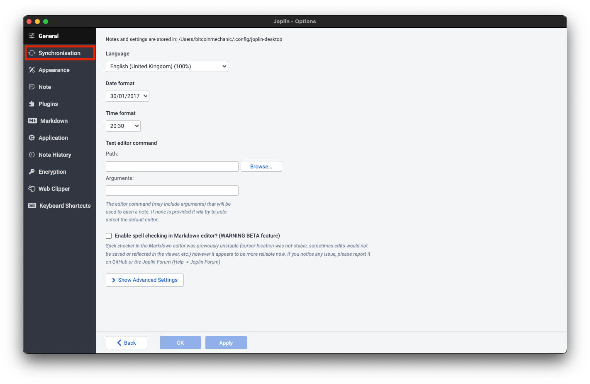

# Connecting Joplin to Nextcloud

This guide will go over how to connect Joplin running on a desktop machine to your StartOS Nextcloud over LAN.

This guide assumes your Nextcloud username is _admin_

It also assumes that you have set up LAN on your desktop machine. If you still need to do that, please head here - https://docs.start9.com/latest/user-manual/connecting/connecting-lan/

1. First go into Nextcloud on your server and click here

    

1. Click on the + icon, then "New folder"

    

1. Create a new folder called _joplin_ and click the arrow to the right

    

1. Click on _Files settings_ in the bottom left and copy the WebDAV link

    

    

1. Open up Joplin, click on _Joplin_ in the top left and click _Preferences_ (on Mac).

    

1. Click on _Synchronisation_

    

1. Under _Synchronization target_ select *Nextcloud*, paste the WebDAV and append onto the end of it _joplin_ so the entire URL should look like this (replace "xxxx" with your unique Nextcloud LAN address): _https://xxxx.local/remote.php/dav/files/admin/joplin_

    

1. Under _Nextcloud username_ enter _admin_

1. Under _Nextcloud password_ enter your password

1. The username and password for your Nextcloud can be found in your StartOS UI by clicking on the Nextcloud service then clicking on _Properties_

    

    

1. Now click _Show advanced settings_

    

1. Scroll down then check the box that says _Ignore TLS certificate errors_

    

1. Now scroll back up and select _Check sychronisation configuration_ and you should see the following success message:

    

1. You have now connected your Joplin client to your server's Nextcloud!
